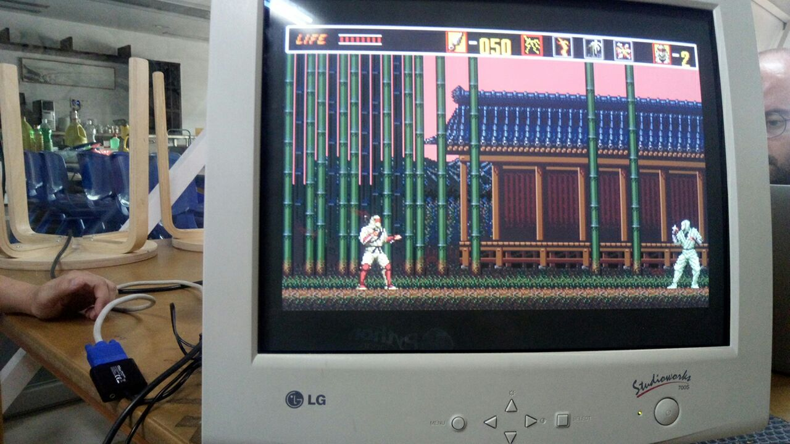

# 26/07/2019

Este Viernes se ha estado trabajando en comprobar que los componentes conseguidos ya funcionan. Se ha instalado y comprobado que la Raspberry pi funciona con Retropie y se han añadido algunas ROMS de prueba.

Vamos a repatir tareas y tenemos que diseñar los planos para cortar la Madera para hacer el mueble.

En las próximas semanas se seguirá trabajando en los muebles.