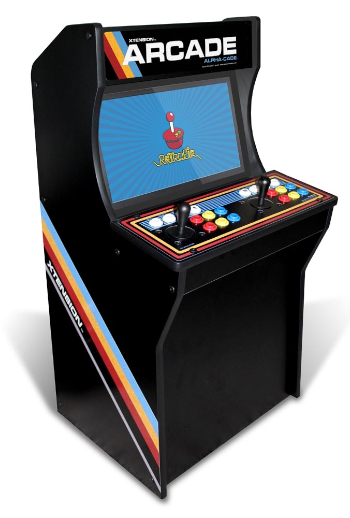

# Taller de contrucción de una máquina recreativa 

Proyecto para el verano de 2019. 

En este proyecto se pretende de crear una recreativa a partir de una Raspberry Pi; creando un proyecto colaborativo entre todos los integrantes de la asociación. Comenzando por la recolección de los materiales y la planificación de las tareas, en esta web se irá mostrando todos los pasos necesarios a realizar y un diario a cerca de las sesiones que se han ido realizando.

En primer lugar, vamos a mostrar la recreativa que se quiere construir:

Como se puede ver en la imagen se trata de una recreativa de cuerpo entero (no siendo una "bartop"). Además de que se utilizará la distribución para emular diferentes sistemas de retropie.

## Materiales

Seguidamente se muestra una tabla con los materiales (incluyendo un enlace de compra).

| Conseguido | Material         | Enlace | Observaciones |
|------------|------------------|--------|---------------|
|     ✔   | Raspberry Pi 3B+ |    [https://www.pccomponentes.com/raspberry-pi-3-modelo-b-plus](https://www.pccomponentes.com/raspberry-pi-3-modelo-b-plus)    |               |
|     ✔      |     Cargador Raspberry Pi 2,5A 5,1V             |   [https://www.pccomponentes.com/fuente-de-alimentacion-para-raspberry-pi-3-51v-1-salida-25a-13w-negra](https://www.pccomponentes.com/fuente-de-alimentacion-para-raspberry-pi-3-51v-1-salida-25a-13w-negra)     |               |
|     ✔       |       Tarjeta Micro SD 16/32Gb           |    [https://www.pccomponentes.com/intenso-tarjeta-microsd-sdhc-16gb-clase-10](https://www.pccomponentes.com/intenso-tarjeta-microsd-sdhc-16gb-clase-10)    |               |
|     ✔       |       Funda Raspberry Pi           |    [https://www.pccomponentes.com/raspberry-new-carcasa-oficial-para-raspberry-pi-3-b-negra](https://www.pccomponentes.com/raspberry-new-carcasa-oficial-para-raspberry-pi-3-b-negra)    |       Opcional        |
|      ✔      |        Pantalla CRT   16 ''       |        |       Donada        |
|      ✔      |          Convertidor HDMI a VGA        |    [https://www.pccomponentes.com/unotec-cable-adaptador-hdmi-a-vga](https://www.pccomponentes.com/unotec-cable-adaptador-hdmi-a-vga)    |               |
|      ✔      |        Joistick Arcade (x2)      |      [Joistick Arcade](https://es.aliexpress.com/item/33017830386.html?mb=Xv1WVKymoBpJ4a6&srcSns=Telegram&tid=white_backgroup_101&tt=sns_Other&aff_platform=default&cpt=1563470839884&sk=c4MkXBNI&aff_trace_key=738b4135c8784e8ab058a96baa667dbb-1563470839884-06516-c4MkXBNI&businessType=ProductDetail&templateId=white_backgroup_101&platform=AE&terminal_id=7937184d6c5c435bbc7e4f82defbb66a)    |    |
|        | Altavoces   |   |   |   |
|    ✔   | Madera (Aglomerado DM)    |    |    |
|        |    Plastico Transparente (no metraquilato)    |    |    |
|        |    Imprimación (Pintura)    |    |    |
|        |    Pintura negra    |    |    |
|        |    Papel (lija)    |    |    |
